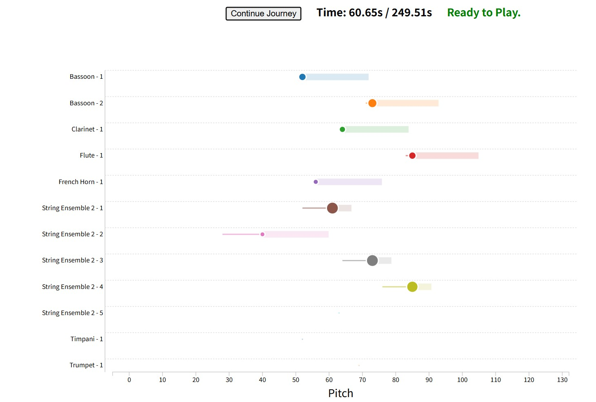

# Pitch Visualization


The project converts MIDI note events into structured data and visualizes the relationship between pitch, instruments, and time using D3.js.

Example: *Peer Gynt Suite No. 1 – Morning Mood*



[demo video](assets/demo.mp4)

## Visualization

The visualization represents music in a two-dimensional space.

### Pitch

The horizontal axis represents **pitch**.

Lower notes appear on the left, while higher notes appear on the right.


### Instrument

The vertical axis represents **instruments**.

For classical orchestral music, instruments are arranged according to the traditional score order:


    Woodwinds
    Brass
    Strings
    Percussion


This allows the interaction between different sections of an orchestra to be observed visually.


### Note Representation

- **Moving circles** represent individual notes.
- **Horizontal position** indicates pitch.
- **Vertical position** indicates instrument.
- **Trailing tails** represent note duration.
- **Horizontal traces** show recent pitch activity within a time window.


## How It Works

1. MIDI files are processed with Python to extract note events.
2. The processed CSV data is loaded by a D3.js visualization.
3. Audio playback time drives the animation and synchronizes the visualization.


## Requirements

-   Python 3.11+

## Run

Install dependencies:

```bash
python -m pip install -r requirements.txt
```

Process MIDI file

``` bash
python scripts/midi_to_csv_clean.py \
    --midi assets/midi/YOUR_FILE_NAME.mid \
    --classical \
    --output-dir data/processed/csv
```

Here, for classical orchestral files, we add a:

    --classical

to enable classical instrument ordering arranged in groups, like in the traditional score. In other cases, it can be not added to show the original instruments' name.


Start a local server:

``` bash
python -m http.server 8000
```

Then open the live server.


## Project Structure

```
.
├── assets/
│   ├── audio/
│   └── midi/
├── data/
│   └── processed/
├── scripts/
│   └── midi_to_csv_clean.py
└── index.html
```
## Notes
 - The CSV and MP3 files should share the same base filename.
 - To visualize another piece, update the filename configuration in `index.html`.
 - Browser autoplay restrictions may require starting playback manually.